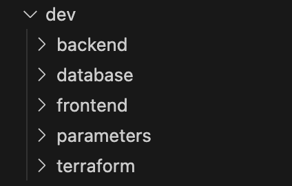
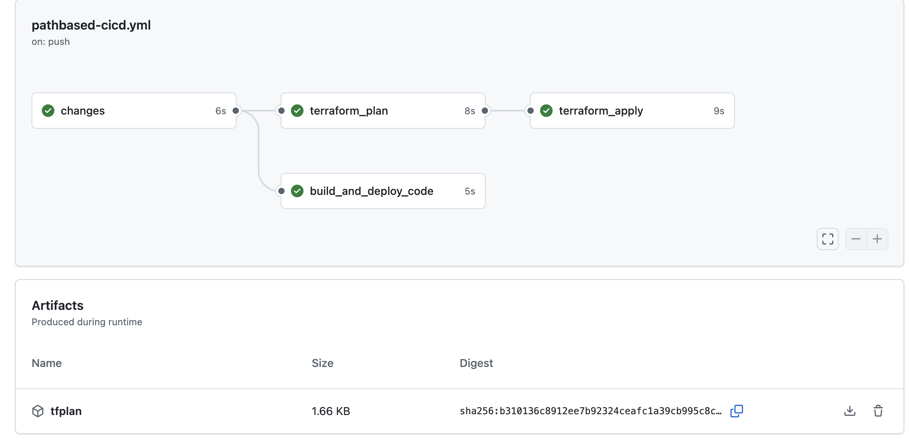
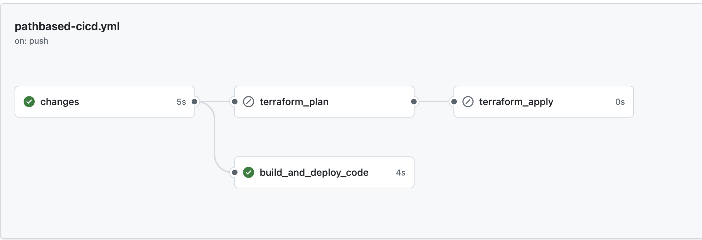
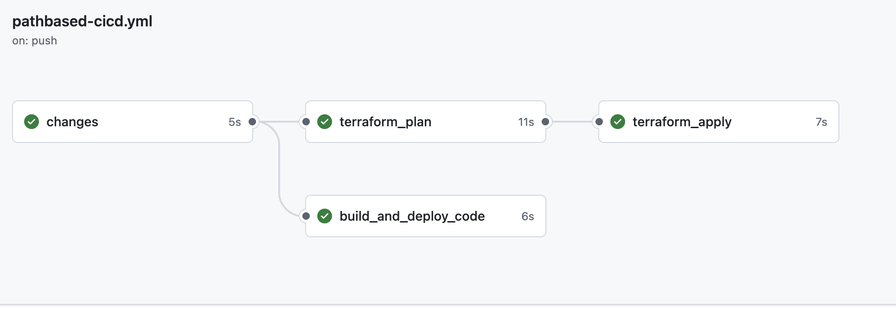
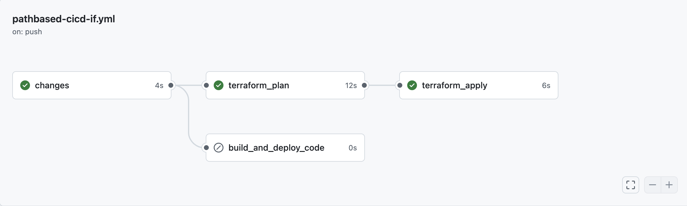

# Path-Based Pipelines using GitHub Actions

## **Definition**

- Path-based CICD/ selective pipelines only runs part of the pipeline that is affected by code changes rather than re-running the entire pipeline from scratch. 
- Instead of treating the repository as one big unit, the pipeline reacts to where the changes are made. 
- Full-pipelines are preferred when dealing with small couplings where multiple components are tightly coupled with one another. 

## **Uses and Advantages:**

- It prevents **unnecessary redeployment** of infrastructure that are unchanged after the pushes, and rebuilding everything.
- This ensures **more efficiency**, and is especially effective with larger repositories where certain parts of the pipelines might compile for a long period of time (terraform plan and apply stages)
- Any minor changes won't lead to massive re-deployments that could take hours. 
- There is also a **lower infrastructure change risk** since number of re-deployments are reduced. 
- Results in **reduced costs**. 
- Allows for greater scalability and allows **faster parallel development** and multiple teams to work independently without affecting each other's work. 
- Greater **separation of concerns**
- Faster **debugging** and clearer signals

## **Proof of Concept: Using Github Actions**

### Step 1: Configuring project folder and repository

- Create an empty repository, example `pathbased-cicd` 
-  Initialize this repository in your local machine in the project folder where you want to execute this pipeline in.
```
    git init
    git remote add origin https://github.com/username/reponame.git\
```

-   Create a new branch 'main' and switch to it  ```
  ```
  git branch -M main/ git checkout -b main
  ```
  
-  Create a folder .github/workflows in your project folder. This is where your github pipelines will exist. 
- Make sure to structure your folder to follow the principle of separation of concerns as much as possible. Here is a sample for the same:

  

### Step 2: Write scripts in each folder

- Create a sample script in each folder to run
- Eg: under database/run_database.sh (this can be followed for all codestreams except terraform)

  ```
  #!/bin/bash
	echo "Database script executed"
	date
  ```

- Eg: under terraform/main.tf

  ```
  terraform {
	  required_providers {
	    null = {
	      source = "hashicorp/null"
	      version = ">= 3.0"
	    }
	  }
	}
	
	provider "null" {}
	
	resource "null_resource" "test" {
	  provisioner "local-exec" {
	    command = "echo Terraform ran at $(date)"
	  }
	}
	
	#no aws account is required to run this terraform code. 
  ```

### Step 3: Building the Pipeline:

- Sample code found on https://github.com/aditirajesh/pathbased-cicd. Save the code under the .github/workflows folder as a .yml file. 
- A github linux runner (ubuntu-latest) is used to run the jobs on this pipeline. A self-hosted runner can also be used but needs to be properly configured. 
- ***changes***: checks if the change made to the pipeline is a normal code file, or a terraform file. This is done by using dorny/paths-filter@v3
- ***build_and_deploy_code***: This part of the pipeline is executed for any normal code changes. For a greater level of isolation, this can be split into multiple jobs -> one for backend, frontend, database, etc to further ensure no re-running of unaffected scripts. 
- ***terraform_plan***: re-runs terraform plan in case change made to tf script turns up true. Terraform plan and apply stages are maintained separately to ensure that errors are caught early before apply. 
- ***terraform_apply:*** final stage that applies all the changes.
- ***concurrency***: is a variable used to ensure that terraform builds are done sequentially

### Step 4: Push code into the repository:

- Add your files and push them into the repository
  ```
	  git add .
	  git commit -m "initial commit"
	  git push origin main
  ```

- Go to your remote repository. You should see a pipeline executing under ```Actions```


## **Outputs:**

### Case 1: Changes to code and terraform 

- Both jobs get triggered and executed. 
- Terraform artifact gets produced during runtime.
- 

### Case 2: Changes to code, not terraform

- Only ***build_and_deploy_code*** job gets executed
- No terraform artifact produced 
- 

### Case 3: Changes to terraform, not code: No if condition

- All jobs run
- Terraform artifact produced
- No 'if' condition specified under ***build_and_deploy_code*** : all jobs will run when code changes to terraform is present. This is a default which always builds any code changes. This only prevents any unnecessary infra apply:
- 

### Case 4: Changes to terraform, not code: If condition 

- Only ***terraform_plan and terraform_apply*** jobs run 
- Terraform artifact produced
- In this case ***build_and_deploy_code*** job gets skipped and does NOT run. 
- 

## **New Edits:**
- Two new pipelines have been added as a part of cross-repository pipeline workflow (refer https://github.com/aditirajesh/deployment-repo)
  